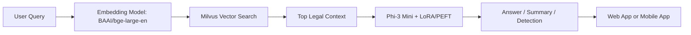

# NyayaMitra


NyayaMitra is a retrieval-augmented legal AI assistant for the Indian judicial ecosystem. It combines semantic search, legal document summarization, and domain-tuned generation so lawyers, researchers, and students can find relevant precedent faster than manual search workflows.

## Problem

Legal research in India is slow, fragmented, and difficult to scale across large judgment collections. Traditional workflows require manual reading, keyword search, and repeated cross-referencing across court decisions, which makes precedent discovery time-consuming and error-prone. NyayaMitra was built to reduce that burden and make legal context retrieval more accessible.

## Solution

NyayaMitra uses a RAG pipeline to ground answers in retrieved court judgments rather than relying only on model memory. The system indexes 200,000+ judgments, retrieves the most relevant passages with dense embeddings, and then uses a fine-tuned Phi-3 Mini model to generate grounded responses, summaries, and legal assistance outputs.

The project also includes fake legal news detection and summarization capabilities, making it useful as a broader legal workflow assistant rather than only a chat interface.

## Architecture

1. Data ingestion and indexing
   - Court judgments and legal text are embedded with BAAI/bge-large-en.
   - Vectors are stored and searched through Milvus.

2. Retrieval layer
   - User queries are converted into semantic vectors.
   - The most relevant judgment chunks are retrieved as legal context.

3. Generation layer
   - Phi-3 Mini is fine-tuned with LoRA/PEFT for Indian legal QA.
   - Retrieved context is passed into the generation pipeline for grounded answers.

4. Service layer
   - FastAPI exposes backend endpoints for summarization, generation, and fake-news detection.
   - The app is deployed on Google Cloud for web access.

5. Client layer
   - The web experience is available through the Streamlit-based interface.
   - A Flutter mobile app provides on-the-go access.



## Results

- Indexed and searched over 200,000+ Indian court judgments.
- Reduced legal research time by up to 70% versus traditional manual workflows.
- Published work at the 10th International Conference on Mining Intelligence and Knowledge Exploration (MIKE 2025).

## Demo

Live demo: [https://legalragchatbot.streamlit.app/](https://legalragchatbot.streamlit.app/)

## Setup

### 1. Clone the repository

```bash
git clone <your-repo-url>
cd NyayaMitra
```

### 2. Create a Python environment

Use Python 3.12 or compatible and create a virtual environment for the backend and RAG pipeline.

```bash
python -m venv .venv
.venv\Scripts\activate
```

### 3. Install backend dependencies

```bash
pip install -r RAG_pipeline/requirements.txt streamlit fastapi uvicorn peft
```

### 4. Install Flutter dependencies

```bash
cd chat_app
flutter pub get
```

## Basic Run Instructions

### Run the FastAPI service

From the `Codes/` directory, start the legal generation API used by the project:

```bash
cd Codes
uvicorn app:app --reload
```

### Run the Streamlit RAG app

From the `RAG_pipeline/` directory, start the document upload and retrieval UI:

```bash
cd RAG_pipeline
streamlit run app.py
```

### Run the Flutter mobile app

From the `chat_app/` directory, launch the mobile client:

```bash
cd chat_app
flutter run
```

## Tech Stack

- Python
- FastAPI
- Streamlit
- Flutter
- RAG
- Phi-3 Mini
- LoRA / PEFT
- Milvus
- BAAI/bge-large-en
- Google Cloud

## Repository Layout

- `RAG_pipeline/` - core retrieval, generation, summarization, and backend service code
- `Codes/` - training, evaluation, inference, and experimental scripts
- `chat_app/` - Flutter client
- `NyayaMitra_app/` - web landing/demo page
- `Adapters/` - fine-tuned adapter artifacts
- `Scrapers/` - judgment collection and preprocessing notebooks/scripts

## Notes

This project was written up for publication and the README now reflects the research-backed product story: the legal research problem, the RAG-based solution, the deployment architecture, and the measured impact.